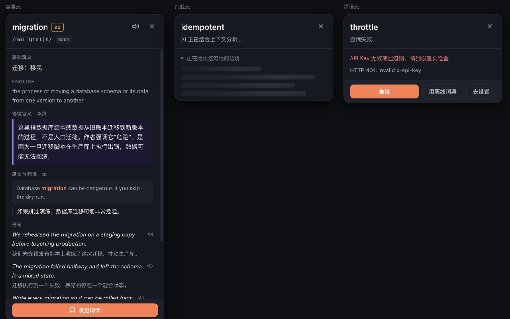
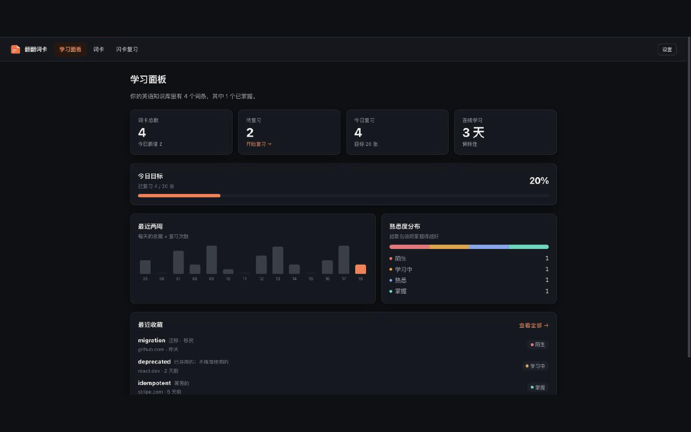
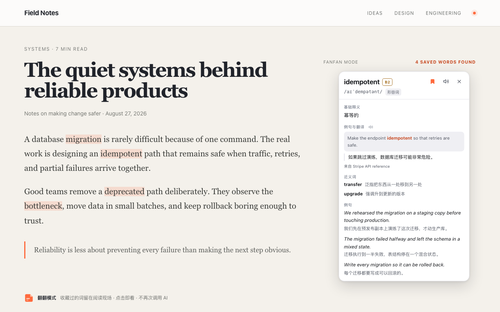
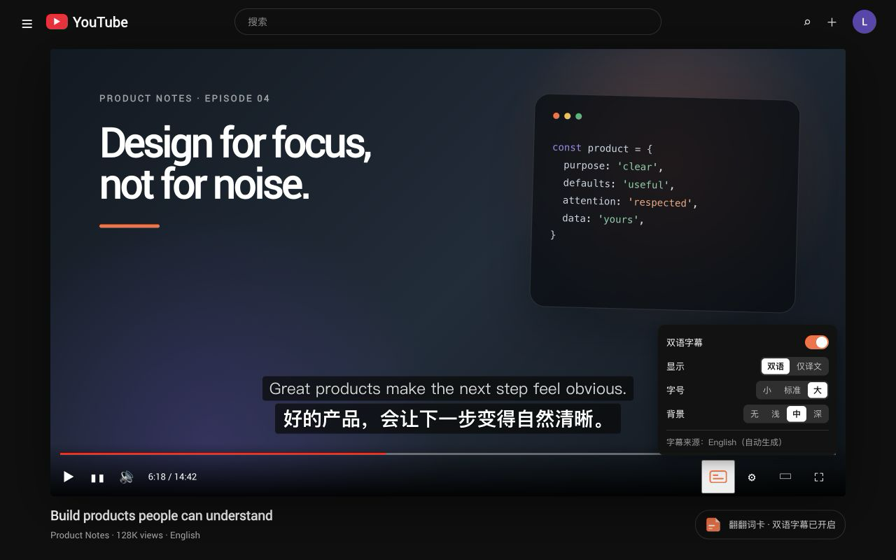

<p align="center">
  
</p>

<h1 align="center">翻翻词卡</h1>

<p align="center"><em>在真实英文环境中阅读，把每一次语言障碍变成你自己的英语知识资产。</em></p>

<p align="center">
  <a href="https://chromewebstore.google.com/detail/%E7%BF%BB%E7%BF%BB%E8%AF%8D%E5%8D%A1-%E2%80%94-ai-%E8%8B%B1%E8%AF%AD%E9%98%85%E8%AF%BB%E5%8A%A9%E6%89%8B/ejhmidlnfffkpolnaiflfaojgfbngjba"><strong>Chrome Web Store</strong></a>
  ·
  <a href="https://luffyliu.com/fanfan-cards/"><strong>产品主页</strong></a>
</p>

一个 AI 驱动的英语阅读与学习 Chrome 扩展（Manifest V3）。它不是"英文 → 中文"的翻译插件，
而是一条完整的学习闭环：

```
真实英文网页 → 划词 → AI 结合上下文解释 → 收藏进个人词卡 → 闪卡复习 → 数据面板看见成长
```

## 为什么不是又一个翻译插件

普通划词翻译给你一条词典释义，读完就丢。这个产品保留的是**读者当时的处境**：

| | 普通翻译插件 | 翻翻词卡 |
|---|---|---|
| 输出 | 词典义 | 词典义 **+ 这句话里它到底指什么** |
| 上下文 | 丢弃 | 抓取原句和段落，随词条一起存下来 |
| 资产 | 无，关掉即消失 | 词卡 + 来源 + 复习记录，本地可导出 |
| 之后 | 下次再查一遍 | 进入复习队列，按熟悉度调度 |

举例：读到 `Database migration can be dangerous.`，选中 `migration`——

- 普通插件：**迁移；移民**
- 这个产品：**基础释义**「迁移；移民」+ **语境含义**「这里指数据库结构或数据从旧版本迁移到新版本，
  不是人口迁徙」+ AI 例句 + 一键收藏（连同原句、来源页面一起存档）

## 功能

**翻翻模式** — 词库里收藏过的词会在任何网页上被轻量标出，**颜色跟着你的记忆走**：
陌生的是品牌橙，学会一点转琥珀，熟悉了退成冷蓝，掌握之后只剩一层没有色相的灰——
也可以设置成干脆不标。深浅由**这一页量出来的底色**决定，而不是操作系统的主题，
所以在自己切了深色的网站上（ChatGPT、GitHub、X）一样看得清。
点击直接查看当时保存的释义、例句和近义词，不再次调用 AI，也不产生新的模型费用；
匹配与高亮完全在本机完成。

**AI 划词解释** — 选中单词或短语，浮层给出音标、基础释义、**结合当前网页上下文的解释**、
英文释义、AI 例句、近义词，并高亮显示原句。支持三种触发方式（小按钮 / 立即解释 / 按住 Alt）、
右键菜单和快捷键。

**个人词卡** — 收藏的每个词都带着它的来源句子、页面、时间与产出它的模型。支持搜索（词、释义、
原句都可搜）、按熟悉度筛选、排序、详情抽屉、手动调级、个人笔记、JSON / CSV 导出。

**闪卡复习** — 正面单词，翻面给出释义、语境含义、例句和**当时读到它的那句原文**。四级自评
（忘记 / 模糊 / 记得 / 掌握）驱动四档熟悉度与复习间隔。全键盘操作：空格翻面，1–4 打分。

**学习面板** — 收藏总数、待复习数、今日目标进度、连续学习天数、近两周活跃柱状图、熟悉度分布、
最近收藏。全部由本地数据真实计算，没有一个装饰性指标。

**段落与整页翻译** — 悬停翻译当前段落，或用快捷键翻译整页。译文追加在原文旁边，
不会替换或重排原网页。

**YouTube 双语字幕** — 在播放器控制栏直接开启原文 + 译文字幕，也可切换为仅译文，
并调整字号与背景深浅。






**同步到 GitHub 私有仓库** — 填一个 Personal Access Token，扩展自动替你创建私有仓库，
之后每次同步都是一次提交：`vocabulary.json`（机器读）+ `VOCABULARY.md`（人读，按字母分组）+
`README.md`（统计首页）。**commit 历史就是你的学习记录**。同步是双向合并，不是覆盖。

**多模型 & 零配置起步** — 默认离线词典模式，装上即可跑通全流程；填入任一 API Key
（Claude / OpenAI / DeepSeek / Gemini / 任意 OpenAI 兼容网关）即可获得真正的语境解释。
Key 只存在本机，请求由扩展后台直发服务商。

## 品牌

**翻翻词卡**：翻译、翻阅、翻页、翻卡——一个「翻」字，四个动作，都是产品里真实发生的事。

它每天出现在你正在读的那段文字旁边，而那段文字才是主角。所以整套视觉的第一原则是**沉静**：
冷墨中性色承担一切，品牌色只作标点。

<table>
<tr><td><b>焰橙 Flame</b> <code>#FF6A3D</code></td><td>此刻该做的动作 —— 主按钮、当前进度、今天</td></tr>
<tr><td><b>靛紫 Violet</b> <code>#5B45B0</code></td><td>AI 的产出 —— 语境解释块、整页译文引导线</td></tr>
</table>

两种颜色，两种语义。卡片上那条紫色竖线永远意味着"这段话是模型写的"。**熟悉度阶梯里
没有橙**——一屏五十个词各自带着进度色，会让唯一那个真正该点的按钮彻底消失。

选橙不选紫，是因为货架上 Notion 近乎无色、Duolingo 绿、Linear 紫、Perplexity 青，
**橙是那个空位**。代价是亮橙在白底上只有 2.85:1，所以品牌色是三个变量而不是一个：
`--primary` 只做填充，`--primary-line` 做描边，`--primary-ink` 做文字。
橙色按钮上的白字是 2.85:1，低于 AA——这是一条**记录在案的自觉例外**，
测试把它钉在实测值上，改动品牌色会让它失败而不是悄悄漂移。

其余 **34 组**文字/背景组合在深浅两套主题下全部通过 WCAG AA，并且由
[`tokens.test.ts`](src/styles/tokens.test.ts) 守着——它同时禁止任何人把 `--primary`
用在 `color` / `border-color` / `outline` 上。所有色值只有一个来源：
[`design-token.css`](src/styles/design-token.css)，两份样式表零硬编码色值。

标记是一张卡片和它被掀起的右上角：折角同时是「翻」的动作、卡片的物性，和「掀开就看见
答案」的隐喻。扩展图标由 `npm run icons` 逐尺寸光栅化生成，不作为二进制文件维护。

细节见 [品牌规范](docs/BRAND_GUIDELINE.md) 与 [Logo 设计](docs/LOGO_DESIGN.md)。

## 安装（开发者模式）

```bash
cd fanfan-cards
npm install
npm run build
```

1. 打开 `chrome://extensions`
2. 右上角开启 **开发者模式**
3. 点击 **加载已解压的扩展程序**，选择本项目的 `dist/` 目录
4. 打开任意英文网页（GitHub README、技术博客、Reddit…），选中一个单词

首次安装会自动打开设置页。不填 Key 也能用（离线词典），填了 Key 才有语境解释。

## 开发

```bash
npm run dev        # 构建并监听（改完在 chrome://extensions 点一下刷新）
npm run preview    # 在浏览器里预览所有界面（不用装扩展，带示例数据）
npm run typecheck  # TypeScript strict 检查
npm run test       # 单元测试（纯逻辑：调度、句子抽取、浮层定位…）
npm run smoke      # 用真实构建产物 + 假 Chrome API 跑一遍完整数据流
npm run verify     # 以上全部
npm run icons      # 从代码重新生成图标
npm run zip        # 打包成可上传的 zip
```

## 目录结构

```
src/
├── background/     MV3 service worker：消息路由、菜单、快捷键
├── content/        注入网页的划词 UI（shadow DOM）
│   ├── dom/        选区读取、上下文抽取
│   └── ui/         浮层组件与定位算法
├── popup/          工具栏弹窗
├── options/        设置页（模型配置、行为、数据管理）
├── app/            学习应用外壳（hash 路由）
├── dashboard/      学习面板
├── vocabulary/     词卡列表
├── flashcard/      闪卡复习 + 复习调度算法
├── components/     跨页面共享组件与样式
├── services/       消息、复习、导入导出、朗读
├── storage/        存储适配层与仓储
├── ai/             AI Provider 抽象与各家实现
├── sync/           GitHub 同步（客户端、合并、Markdown 渲染）
└── types/          领域模型与契约
```

## 文档

| 文档 | 内容 |
|---|---|
| [docs/PRODUCT.md](docs/PRODUCT.md) | 产品定位、用户、场景、功能边界与非目标 |
| [docs/ARCHITECTURE.md](docs/ARCHITECTURE.md) | 分层架构、数据流、消息协议、构建产物 |
| [docs/DATA_MODEL.md](docs/DATA_MODEL.md) | 存储结构、字段语义、迁移与导出格式 |
| [docs/TECH_DECISION.md](docs/TECH_DECISION.md) | 关键技术选择及其取舍（含被否决的方案） |
| [docs/BRAND_GUIDELINE.md](docs/BRAND_GUIDELINE.md) | 品牌调性、色彩、字体、界面规范与文案语气 |
| [docs/LOGO_DESIGN.md](docs/LOGO_DESIGN.md) | Logo 概念、几何、用色与使用规范 |
| [docs/PRIVACY.md](docs/PRIVACY.md) | 扩展处理、传输与删除用户数据的方式 |
| [docs/READ_FROG_ANALYSIS.md](docs/READ_FROG_ANALYSIS.md) | read-frog 源码分析：借鉴什么、不借鉴什么 |
| [docs/TODO.md](docs/TODO.md) | 迭代计划与进度 |

## 隐私

完整政策见 [翻翻词卡隐私政策](docs/PRIVACY.md)。

- 所有数据（词卡、复习记录、设置、API Key）只保存在浏览器本地 `chrome.storage.local`。
- 没有服务器，没有账号，没有埋点。
- 只有你主动划词时，被选中的文字及其所在句子会发送给你自己配置的模型服务商。
- 开启 GitHub 同步后，词卡会提交到**你自己账号下的私有仓库**；Token 只在扩展后台使用，
  请求直发 api.github.com，不经过任何中间服务器。
- 随时可以导出全部数据为 JSON，或一键清空。

## 许可

MIT
